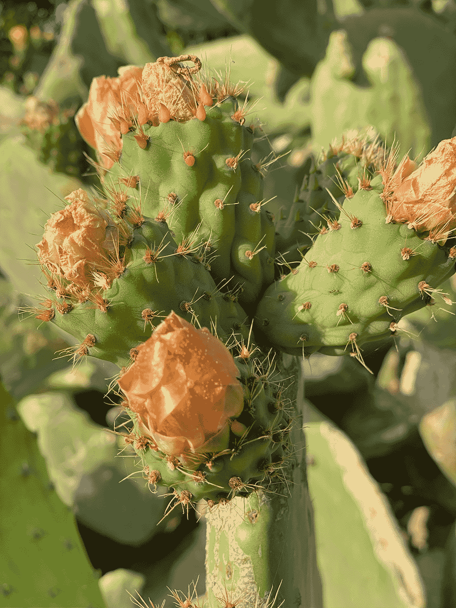
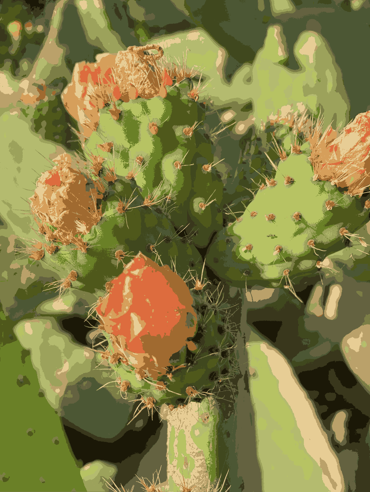

# Color Quantization

This is a quick test project to see how well the FCM color quantization/clustering algorithm works.

We convert the input image to L*a*b colorspace to improve the result quality.  We downsample the image to a size that can be processed in a few minutes.  We then run the FCM algorithm on the image as recommended by [1] to simplify the image into 16 solid color regions.  The result is converted back to RGB colorspace and written as a PNG image.

Real-time output from Adobe Photoshop that looks better than FCM at first glance:



Photoshop solves the color quantization problem but not the clustering problem.  I'm guessing they do histogram equalization and dithering.  The problem is that neighboring pixels are usually very different colors.  This is not what we want for color quantization.  We want to group similar colors together.

FCM output (2 minutes to process):



These results are useful for the input to the next stage in an automatic image vectorization/segmentation pipeline.

## Reproduce Results

```bash
pip install -r requirements.txt
python fcm.py
```

You can check the number of colors in the output image with the following command:

```bash
convert image.png -format %c -depth 8 histogram:info:-
```

## References

[1] "A Comparison of Fuzzy Clustering Algorithms
Applied to Feature Extraction on Vineyard" (Correa, 2011) available https://core.ac.uk/download/pdf/148658811.pdf
